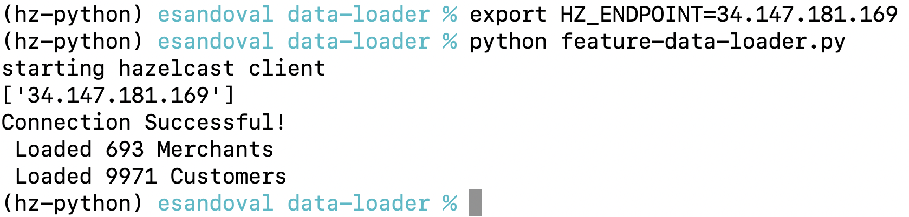

# Before you start
Make sure you have
* A Google Cloud Kubernetes Engine (GKE) cluster with 4 nodes. Each with:
    * 32 VCPU cores and 
    * 32 GB memory
* Your Google Cloud user has:
    * The `Owner` Role in the Google Cloud Project your GKE cluster is running on OR
    * A role containing the `container.clusterRoleBindings.create` permission.  This perms is included in `Kubernetes Engine Admin`


* [Kubectl](https://kubernetes.io/docs/tasks/tools/)
* [gcloud](https://cloud.google.com/sdk/docs/install)
* [Helm](https://helm.sh/docs/intro/install/) 
* [Hazelcast CLI tool 5.3.1](https://docs.hazelcast.com/hazelcast/5.2/getting-started/install-hazelcast#using-the-binary)
* [Conda](https://conda.io/projects/conda/en/stable/user-guide/install/index.html) or any other way of creating a Python 3.11 virtual environment (venv)


# Fraud Detection With Hazelcast 
In this demo, you will deploy a Real-time Fraud Detection Solution to Hazelcast. 


The main components are:
* A Confluent-hosted Kafka Topic storing fake credit card transactions
* A 3-node Hazelcast cluster that
    * Subscribes to the Kafka `transaction` topic (data in motion)
    * Enriches transactions with customer and merchant data (data at rest)
    * Executes a transaction processing pipeline, which includes running a Python ML model
* A Java client that defines and submits a real-time inference pipeline to Hazelcast for distributed execution. This pipeline simultaneously:
    * Calculates number of transactions in the previous 24 hours
    * Calculates number of transactions in the previous 7 days 
    * Calculates amount spent in the last 24 hours
    * Calculates fraud probability using a LIghtGBM trained model
    * Stores the transaction and fraud prediction in memory for SQL analysis
* A Fraud Analytics dashboard displaying fraud predictions by customer, city and other dimensions
* Hazelcast Management Center

## Fraud Analytics Dashboard
By the end of this demo, you will be able to visualize fraud predictions. This dashboard was built in Python and uses SQL to retrieve predictions ge from Hazelcast


# Let's Get Started - Clone this Repo
```
git clone https://github.com/hazelcast/fraud-detection-python.git
git checkout -b 5.3-kafka
cd fraud-detection-python
```

NOTE: If your clone command fails, set up a Github Personal Access token as [described here](https://www.shanebart.com/clone-repo-using-token/). 

Ensure you set a reasonable expiry date and set scope to: repo, user, admin:public_key


# STEP 1: Set up Your Kubernetes Cluster 


Make sure you have a Kubernetes cluster and your `kubectl` command pointing to it. 

We will use Google Kubernetes Engine (GKE) in this setup but you could use another Kubernetes provider. 

In GKE, create a cluster named `hz-fraud-detection-python`. Ensure your cluster has 5 nodes with at least 8 VCPUs and 8GB memory each.
You can use this [video as guide to create your GKE Cluster](https://youtu.be/hxpGC19PzwI?t=395)

Once created, you can point `kubectl` to it by running
```
gcloud container clusters get-credentials hz-fraud-detection-python --zone europe-west2-a --project <your-gke-project>
```

## Deploy a 3-node Hazelcast Cluster, Management Center, Fraud Dashboard & Data loader PODS
First, prepare your Kubernetes cluster with
```
kubectl apply -f https://raw.githubusercontent.com/hazelcast/hazelcast-kubernetes/master/rbac.yaml
helm repo add hazelcast https://hazelcast-charts.s3.amazonaws.com/
helm repo update
```

Finally, deploy all components with
```
helm install -f values.yaml hz-python hazelcast/hazelcast && kubectl apply -f hz-pods.yaml 
```

Wait 3-5 minutes and **ALL 5 PODS** should be **RUNNING**
```
kubectl get pods
```
The output should be similar to


Let's grab the Hazelcast endpoint to our cluster with
```
kubectl get services
```
You should see the following SERVICES available


Make a note of the EXTERNAL-IP for your Hazelcast cluster. Look for the `hz-python-hazelcast` service. In this example, it is `34.147.181.169`

Set environment variables
```
export HZ_ENDPOINT=<your-hz-python--service-external-ip>:5701
export KAFKA_CLUSTER_KEY=<ask your kafka admin>
export KAFKA_CLUSTER_SECRET=<ask your kafka admin>
export KAFKA_CLUSTER_ENDPOINT=<ask your kafka admin>
```
NOTE: Your Kafka admin had previously created a Confluent Kafka Cluster with a topic (10 partitions) holding the transactions that will be run through the Hazelcast real-time inference pipeline

# STEP 2: Load Customer and Merchant data to Hazelcast (In-Memory data store)

```
cd data-loader
```
## Create a Python virtual environment (do this only 1st time you run the demo)
If you haven't created a virtual environment for the data loader yet, create a Python 3.11 virtual environment. 
```
conda create --name hz-python python=3.11
```
Activate the environment
```
conda activate hz-python
```
Install Hazelcast Python client library on the Python environment
```
pip install -r requirements.txt
```
## Activate your virtual environment (if you have previously created one)
Activate the environment
```
conda activate hz-python
```
Load the Customer and Merchant data
```
python feature-data-loader.py    
```

The output should confirm that Customer and Merchant data is now stored in Hazelcast



# STEP 3: Submit Real-time Inference Pipeline to Hazelcast

## 3.1 MAC & Linux Users
You can deploy the real-time inference pipeline by running
```
cd ../deploy-jobs
```
Folowed by
```
hz-cli submit -t $HZ_ENDPOINT -v -c org.example.StreamingFeatures target/deploy-jobs-1.0-SNAPSHOT.jar 
```

## 3.2  Windows Users!
> :warning: **Windows users, run this hz-cli command instead**: Replace `your-hz-python--service-external-ip` with the above EXTERNAL-IP 
> address for the `hz-python-hazelcast` service

```
docker run \
    -v "$(pwd)"/target/deploy-jobs-1.0-SNAPSHOT.jar:/usr/lib/hazelcast/deploy-jobs-1.0-SNAPSHOT.jar \
    -e HZ_ENDPOINT=<your-hz-python--service-external-ip>:5701 \
    -e KAFKA_CLUSTER_KEY=<ask your kafka admin> \
    -e KAFKA_CLUSTER_SECRET=<ask your kafka admin> \
    -e KAFKA_CLUSTER_ENDPOINT=<ask your kafka admin> \
    --rm edsandovalhz/hz-531-python-310 \
    /usr/lib/hazelcast/bin/hz-cli submit -t <your-hz-python--service-external-ip>:5701 -c org.example.StreamingFeatures /usr/lib/hazelcast/deploy-jobs-1.0-SNAPSHOT.jar
```

## What is the Real-time Inference pipeline doing?
Your inference pipeline has now been deployed to Hazelcast. But wait, what is this pipeline doing? 

The picture below illustrates what this real-time pipeline is automating


Broadly speaking, The real-time inference pipeline orchestrates the execution of the following steps:
* **Ingest** - transactions are retrieved from a Kafka topic. Using Hazelcast stream processing primitives, we calculate  "transactions in the last 24 hours", "amount spent in previous 24 hours", transactions in the last 7 days" **for every credit card!**. These values are are immediately available for fraud scoring!
* **Enrich** - Using credit card number and merchant code on the incoming transaction, it looks up data in already in Hazelcast about the "customer" and "merchant". 
* **Transform** - Prepare a Fraud Detection Request (in JSON format) combining all of the information required by the Fraud scoring model.
* **Predict** - Scores the probability of fraud for each transaction. It runs LightGBM model on each transaction.
* **Act** - Stores the transaction and fraud probability in the `predictionResult` MAP (Hazelcast in-memory data store) for real-time fraud analytics. 


You can find a full description of the [inference pipeline here](./inference-pipeline.md)


# STEP 4: Monitor your Inference Pipeline in Management Center
Go back to your main Terminal Window

Let's grab your management center IP address
```
kubectl get services
```
You should see the following SERVICES available


Make a note of the EXTERNAL-IP for your management center. Look for the `hz-python-hazelcast-mancenter` service. 
In this example, it is `35.189.100.64:8080`

Open a Browser to this location

Navigate to Streaming->Jobs. 

Your Inference pipeline should be processsing transactions


# STEP 5: Let's Visualize transactions and their fraud predictions
Go back your main terminal window

Make a note of the EXTERNAL-IP for your fraud dashboard service. Look for the `fraud-dashboard` service. 
In this example, it is `35.242.180.47:8501`

Open a Browser to this location


Play around with the Analyst - SQL Playground
You can enter a SQL Statement like
```
SELECT * 
FROM predictionResult 
where fraud_probability > 0.7 and customer_name='Carol Serrano'
LIMIT 200
```
Press CMD+ENTER to execute the SQL

Enjoy!

# Gracefully Terminate your Kubernetes Deployment
Go back to you main Terminal
```
helm delete hz-python && kubectl delete -f hz-pods.yaml
```

Finally, 
# Don't forget to DELETE Your Kubernetes cluster
to avoid unnecesary GKE/Cloud bills!

# WANT TO LEARN MORE?

## How was the Feature and Transaction Data Loaded into Hazelcast?

Using Hazelcast Python client. [More details here](./data-loader/README.md)

## How was the Fraud Dashboard built?

With Streamlit as data visualization and Hazelcast Python issuing SQL queries. [More details here](./fraud-dashboard/README.md)

## How was the LightGBM model trained? 

Using a fictional credit card transaction dataset and the LightGBM framework. 

This [Google Colab Notebook](https://colab.research.google.com/drive/1x_j_9tZGwH__ZsdO7ECMWEY3niBuvQUG?usp=sharing) shows a very similar trainning process

When you execute all Cells in the notebook, you can download the trained model


## How was the LightGBM model used to score transactions?

Using Hazelcast's Pipeline API and the `MapUsingPython` function.

The `MapUsingPython` function allows to run distributed machine learning inference in Hazelcast. 

This function can only be used in a Hazelcast Pipeline. See [more details here](./inference-pipeline.md)


