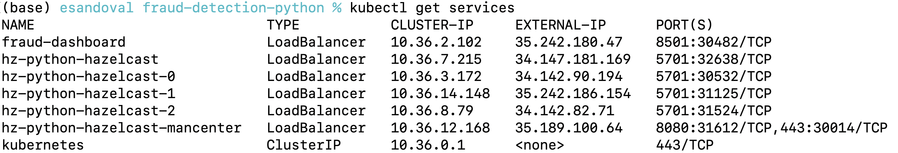

# Before you start
Make sure you have
* A GKE cluster with 4 nodes. Each with
    * 8 VCPUs and 
    * 8GB memory
* Kubectl
* gcloud
* Helm 
* Hazelcast 5.2.1 client (hz-cli tool)

# Fraud Detection With Hazelcast 
In this demo, you will deploy a Real-time Fraud Detection Solution to Hazelcast. 


The main components are:
* A Hazelcast cluster storing fake customer and merchant data (in memory) and running a fraud detection model (written in Python using the LightGBM framework)
* A customer and merchant data loader program (written in Python) showing how to load data into Hazelcast (distributed in-memory data store)
* A client Java program to define and submit the real-time inference pipeline to Hazelcast. This pipeline defines a sequence of steps to determine if an incoming transaction is potentially fraudulent. 
* A Python transaction loader program similuating transactions being sent to Hazelcast
* A Streamlit dashboard illustrating how transactions and fraud predictions can be visualized using Python and SQL
* Hazelcast Management Center

# Clone this Repo
```
git clone https://github.com/hazelcast/fraud-detection-python.git
cd fraud-detection-python
```


# STEP 1: Set up Your Kubernetes Cluster 


Make sure you have a Kubernetes cluster and your `kubectl` command pointing to it. You can use any Kubernetes service provider. We will use Google Kubernetes Engine (GKE) in this setup

In GKE, create a cluster named `hz-fraud-detection-python`. Ensure your cluster has 4 nodes with at least 8 VCPUs and 8GB memory each.

Once created, you can point `kubectl` to it by running
```
gcloud container clusters get-credentials hz-fraud-detection-python --zone europe-west2-a --project <your-gke-project>
```

## Deploy a Management Center, Fraud Dashboard, Data loaders and a 3-node Hazelcast cluster 
First, prepare your Kubernetes cluster with
```
kubectl apply -f https://raw.githubusercontent.com/hazelcast/hazelcast-kubernetes/master/rbac.yaml
helm repo add hazelcast https://hazelcast-charts.s3.amazonaws.com/
helm repo update
```

Finally, deploy all components with
```
helm install -f values.yaml hz-python hazelcast/hazelcast 
kubectl apply -f hz-pods.yaml
```

Wait 3-5 minutes and ALL 6 PODS should be RUNNING
```
kubectl get pods
```
The output should be similar to


# STEP 2: Load Customer and Merchant data to Hazelcast (In-Memory data store)
Open a second Terminal window

Identify your "data-loader" pod name. Check the output of `kubectl get pods`
In the above case, it is `data-loader-6ccbb8b88b-7sjvq`

Open a Terminal to this pod 
```
kubectl exec --stdin --tty data-loader-6ccbb8b88b-7sjvq -- /bin/bash
```
Within that terminal run
```
python feature-data-loader.py
```
The output should confirm that customer and merchant data is now in Hazelcast


# STEP 3: Submit Real-time Inference Pipeline to Hazelcast
Go back to your initial Terminal window. Make sure to keep the Data loader Terminal in a separate window/tab

Let's grab the Hazelcast endpoint to our cluster, run
```
kubectl get services
```
You should see the following SERVICES available


Make a note of the EXTERNAL-IP for your Hazelcast cluster. Look for the `hz-python-hazelcast` service. In this example, it is `34.89.10.163`

Set an environment variable
```
export HZ_ENDPOINT=<your-hz-python--service-external-ip>:5701
```

Now you can deploy the real-time inference pipeline by running
```
cd deploy-jobs
hz-cli submit -t $HZ_ENDPOINT -v -c org.example.Main target/deploy-jobs-1.0-SNAPSHOT.jar 
```

Your inference pipeline has now been deployed to Hazelcast. But wait, what is this pipeline doing? The picture below illustrates what this real-time pipeline is automating


Broadly speaking, the pipeline stages are:
* **Ingest** - placing new transactions in the "transaction" map (in-memory distributed data structure in Hazelcast) triggers the execution of this pipeline
* **Enrich** - Using credit card number and merchant code on the incoming transaction, it looks up data in the "customer" and "merchant" maps. This information was previosuly loaded to Hazelcast in-memory data store (in step 2)
* **Transform** - Calculates the 'Distance from home' feature using location reported in the transaction and customer billing address stored (which is available on the "customer" map)
* **Predict** - Runs the LightGBM model passing the required input data (transformed in the format required by the model)
* **Act** - Stores the fraud probability returned by the model, along with the transaction data in the `predictionResult` MAP (Hazelcast in-memory) for real-time analytics


Check out the Pipeline creation code in `deploy-jobs\src\main\java\org\example\Main.Java`. 
See the `createPythonMLPipeline()` method


# STEP 4: Time to fire some transactions into your Hazelcast inference pipeline!
Go back to your Data loader Terminal Window
```
python transaction-data-loader.py data/transaction-stream-full.csv
```

# STEP 5: Monitor your Inference Pipeline in Management Center
Go back to your main Terminal Window

Let's grab your management center IP address
```
kubectl get services
```
You should see the following SERVICES available


Make a note of the EXTERNAL-IP for your management center. Look for the `hz-python-hazelcast-mancenter` service. 
In this example, it is `34.89.44.29:8080`

Open a Browser to this location

Navigate to Streaming->Jobs. 

Your Inference pipeline should be processsing transactions


# STEP 6: Let's Visualize transactions and their fraud predictions
Go back your main terminal window

Make a note of the EXTERNAL-IP for your fraud dashboard service. Look for the `fraud-dashboard` service. 
In this example, it is `34.105.167.221:8501`

Open a Browser to this location


Play around with the Analyst - SQL Playground
You can enter a SQL Statement like
```
SELECT * 
FROM predictionResult 
where fraud_probability > 0.7 and customer_name='Carol Serrano'
LIMIT 200
```
Press CTRL+ENTER to execute the SQL

Enjoy!

# Gracefully Terminate your Kubernetes Deployment
Go back to you main Terminal
```
helm delete hz-python
kubectl delete -f hz-pods.yaml
```

Finally, 
# Don't forget to DELETE Your Kubernetes cluster
to avoid unnecesary GKE/Cloud bills!


# WANT TO LEARN MORE?

## How was the Feature and Transaction Data Loaded into Hazelcast?

Using Hazelcast Python client. [More details here](./data-loader/README.md)

## How was the Fraud Dashboard built?

With Streamlit as data visualization and Hazelcast Python issuing SQL queries. [More details here](./fraud-dashboard/README.md)

## How was the LightGBM model trained? 

Using a fictional credit card transaction dataset and the LightGBM framework. [Check out this Google Colab Notebook](https://colab.research.google.com/drive/1x_j_9tZGwH__ZsdO7ECMWEY3niBuvQUG?usp=sharing)
The notebook describes most of the training process. You will notice that 
* It only uses 50% of the original dataset for training and 
* it drops a few features 

This was done so you can train a similar model for free on Google Colab. 

When you execute all Cells in the notebook, you can download the trained model


## How was the LightGBM model used to score transactions in a Hazelcast?

Using Hazelcast's Pipeline API and the `MapUsingPython` function.

The `MapUsingPython` function allows to run Python code inside a Hazelcast.

This function must be used in a Hazelcast Pipeline.


