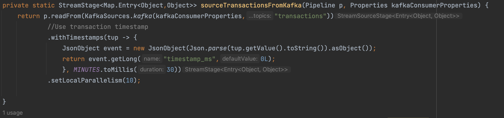

# Running a LightGBM (Python) Model in Hazelcast

You need to include your model in a Hazelcast Pipeline. It defines a sequence of processing steps that need to be carried out before and after the model scores a transaction

The real-time inference pipeline orchestrates the execution of the following steps

* **Ingest** - transactions are retrieved from a Kafka topic. Using Hazelcast stream processing primitives, we calculate and keep (in-memory) values for "transactions in the last 24 hours", "amount spent in previous 24 hours", transactions in the last 7 days". The values are calculated in real-time as trasactions arrive in Hazelcast. 
* **Enrich** - Using credit card number and merchant code on the incoming transaction, it looks up data in already in Hazelcast about the "customer" and "merchant". 
* **Transform** - Calculates the 'Distance from home' feature using location reported in the transaction and customer billing address stored (which is available on the "customer" map). Prepare a Fraud Detection Request combining all of the information available.
* **Predict** - Runs a LightGBM model to get a Fraud Prediction for the transaction
* **Act** - Stores the transaction and fraud probability in the `predictionResult` MAP (Hazelcast in-memory data store) for real-time fraud analytics

# Creating the Inference Pipeline
Let's walk through the Pipeline creation code in [Main.java](./deploy-jobs/src/main/java/org/example/Main.java)

## Ingest

### Java - Start of Stream processsing
This Hazelcast Pipeline starts as transactions start streaming through the `transactions` Kafka topic 

### Java - Calculating Streaming Features
As transactions start flowing, a number of "streaming features" such as "transactions in the last 24 hours", "amount spent in the last 24 hours" and "transactions in the last 7 days" are caclculated FOR EACH CREDIT CARD number!

## Enrich 
The credit card on the incoming transaction is used to look up Customer feature data stored in the "customers" map.

Similarly, the merchant code is used to look up merchant feature data stored in the "merchants" map.

## Transform

## Prepare Prediction Request and Run it in Python

In order to use Python in this Pipeline, we need to prepare a single String input.

Here we call `mapUsingPython` and set up some important parameters for the Python execution environment

### Python

Here is the actual Python code that loads the model and serves predictions.  

By default, Hazelcast will look for the `transform_list()` method within the Python module declared. 
In this case, it is [fraud_handler.py](./deploy-jobs/src/main/resources/org/example/fraud_handler.py). 

Each Hazelcast member is running a number of Python instances as specified in (`localParalellism`). In our case, our 3-member cluster would have a total of 30 Python process instances running across all three members!

