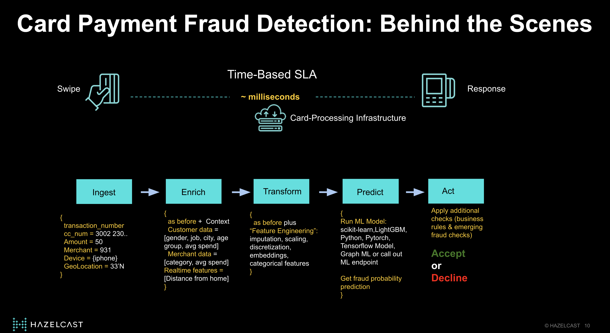

# Running a LightGBM (Python) Model in Hazelcast

You need to include your model in a Hazelcast Pipeline. It is in the pipeline where you define processing steps that need to be carried out before and after the model scores a transaction

The real-time inference pipeline in this demo orchestrate the execution of the following steps

Broadly speaking, the pipeline stages are:
* **Ingest** - placing new transactions in the "transaction" map (in-memory distributed data structure in Hazelcast) triggers the execution of this pipeline
* **Enrich** - Using credit card number and merchant code on the incoming transaction, it looks up data in the "customer" and "merchant" maps. This information was previosuly loaded to Hazelcast in-memory data store (in step 2)
* **Transform** - Calculates the 'Distance from home' feature using location reported in the transaction and customer billing address stored (which is available on the "customer" map)
* **Predict** - Runs the LightGBM model passing the required input data (transformed in the format required by the model)
* **Act** - Stores the fraud probability returned by the model, along with the transaction data in the `predictionResult` MAP (Hazelcast in-memory) for real-time analytics

# Creating the Inferenece Pipeline
Let's walk through the Pipeline creation code in [Main.java](./deploy-jobs/src/main/java/org/example/Main.java)

## Ingest

### Java
This Hazelcast Pipeline is triggered when a new transaction arrives in the "transactions" map.

## Enrich 
The credit card on the incoming transaction is used to look up Customer feature data stored in the "customers" map.

Similarly, the merchant code is used to look up merchant feature data stored in the "merchants" map.

## Transform
Here we calculate the "distance from home" by taking the distance between:
* The customer Lat/Lon stored in his customer profile
* The Lat/Lon reported on the incoming transaction

## Predict

In order to use Python in this Pipeline, we need to prepare a single String input. Here, the transaction, looked up values and "distance from home" stored as a String.

Here we call `mapUsingPython` and set up some important parameters for the Python execution environment

### Python

Here is the actual Python code that loads the model and serves predictions.  

By default, Hazelcast will look for the `transform_list()` method within the Python module declared. In this case, it is [fraud_handler.py](./deploy-jobs/src/main/resources/org/example/fraud_handler.py). Hazelcast will send incoming scoring request to each Python instance created (with `localParalellism`)

# Submitting the Pipeline to Hazelcast (Java)

In [Main.java](./deploy-jobs/src/main/java/org/example/Main.java), the `main()` method shows how to submit the inference pipeline to every member in a Hazelcast cluster. The inference pipeline will run in the same member holding the "customer" feature data. This is the key to achieve high throughput and low-latency!

