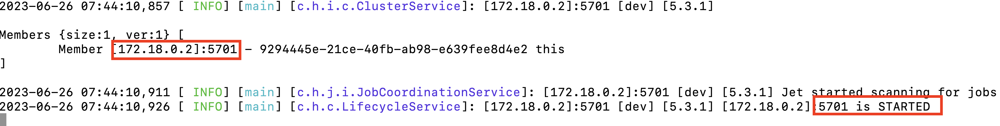
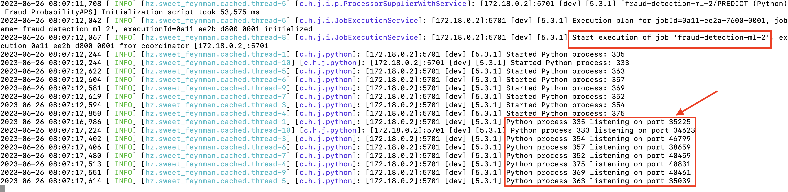
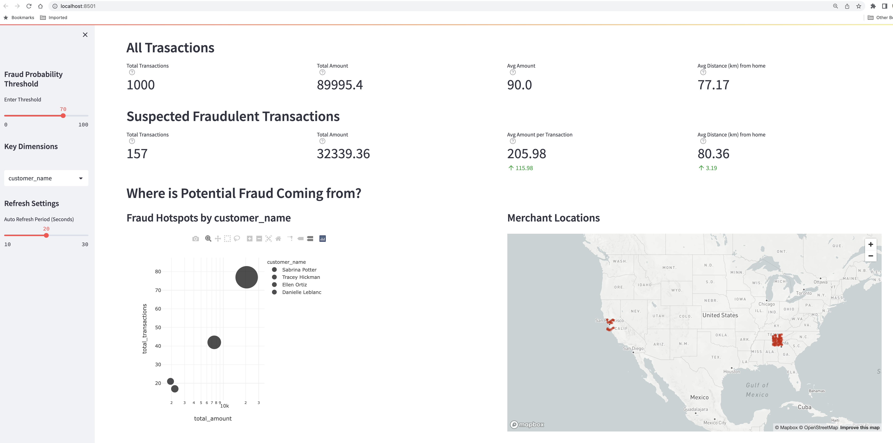

# 1. Start a single-node Hazelcast Cluster


## Before you start
Make sure your system meets the following requirements:
* 10+ CPU Cores
* 16 GB memory


Your system needs to have installed the following software:
* Docker
* [Hazelcast 5.3.1](https://docs.hazelcast.com/hazelcast/5.2/getting-started/install-hazelcast#using-the-binary)
* [Python 3.11](https://www.python.org/downloads/)
* A tool to create Python Virtual environments. Use any of the following:
    * [Conda](https://docs.conda.io/projects/conda/en/latest/user-guide/install/#id2) or
    * [Virtualenv](https://virtualenv.pypa.io/en/latest/installation.html)
    
# 2. Start a single-node Hazelcast Cluster
```
cd hz-image
```

Create a local docker network

``` 
docker network create hazelcast-network
```

Now start Hazelcast Cluster on this network
```
docker run -v "$(pwd)"/config.yml:/usr/lib/hazelcast/config.yml \
    -e HAZELCAST_CONFIG=/usr/lib/hazelcast/config.yml --network hazelcast-network \
    --rm -p 5701:5701 edsandovalhz/hz-531-python-310
```

Make a note of the IP address of the Hazelcast member on the `hazelcast-network`


In this case, it is '172.18.0.2'

# 3. Load Feature and Customer data into Hazelcast
On a separate Terminal window, go to the data-loader folder
```
cd data-loader
```
Create a Python 3.11 virtual environment. I will use Conda
```
conda create --name hz-python python=3.11
```
Activate the environment
```
conda activate hz-python
```
Install Hazelcast Python client on the environment
```
pip install -r requirements.txt
```
Load the Customer and Merchant data
```
python feature-data-loader.py    
```

# 4. Submit the Inference Pipeline to Hazelcast
Change to the the deploy-jobs folder
```
cd ../deploy-jobs
```
Run this Command. Make sure you replace both references to `172.18.0.2` with YOUR Hazelcast IP address.

See Step 2 above to get the Hazelcast IP address on the `hazelcast-network`

```
docker run -v "$(pwd)"/target/deploy-jobs-1.0-SNAPSHOT.jar:/usr/lib/hazelcast/deploy-jobs-1.0-SNAPSHOT.jar \
    -e HZ_ENDPOINT=172.18.0.2:5701 \
    --network hazelcast-network \
    --rm edsandovalhz/hz-531-python-310 \
    /usr/lib/hazelcast/bin/hz-cli submit -t 172.18.0.2:5701 -c org.example.Main /usr/lib/hazelcast/deploy-jobs-1.0-SNAPSHOT.jar
```
NOTE 1: You can safely ignore the error "No jobs submitted"

NOTE 2: You can check your Hazelcast docker logs to confirm Hazelcast member is now running 8 Python instances!



# 5. Send 1,000 transactions to the Inference Pipeline
Back to the data-loder folder
```
cd ../data-loader
```
Run
```
python transaction-data-loader.py data/test.csv 1 100 
```

# 6. Check the Fraud Analytics Dashboard
Go to the fraud-dashboard directory
```
cd ../fraud-dashboard
```
Install additional Python packages needed for the fraud dashboard

```
pip install -r requirements.txt
```

Run the dashboard with
```
export HZ_ENDPOINT=127.0.0.1 && streamlit run app.py
```

A browser window opens 


## Try
* Click on the bubbles and the map chart will focus on the relevant set of transactions
* Try crafting SQL statements on the Analyst Playground (CMD + Enter to execute SQL)


